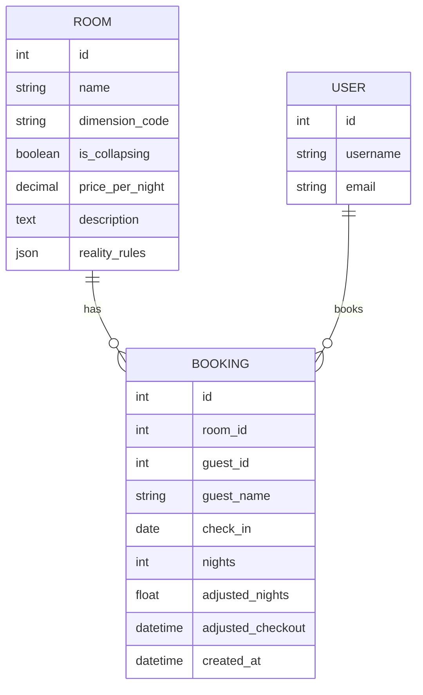

🌌 Interdimensional B&B

A Django-based booking platform for travelers across the multiverse. Manage listings, reality rules, and cross-dimensional reservations.


# 🛠 Tech Stack

- Language: Python 3.12 (via uv)
- Framework: Django 4.2
- CSS Framework: Bootstrap
- Database: PostgreSQL 15
- Containerisation: Docker & Docker Compose


## User Stories

### Travelers
- As a traveler, I can browse available rooms across dimensions and view each room's `reality_rules` and metadata so I can find spaces that match my biological and temporal needs (for example: breathable atmosphere, acceptable gravity).
- As a traveler, I can filter rooms by reality rules (gravity, time dilation, dimension code, warnings) so I avoid stays with dangerous temporal or physical properties.
- As a traveler, I can view portal previews (images) and key room details before booking so I know what to expect on arrival.
- As a traveler, I can select check-in date and number of nights and complete a booking; the system will compute and store `adjusted_nights` and `adjusted_checkout` using the room's `reality_rules`.

### Hosts
- As a host, I can create and manage room listings including `name`, `dimension_code`, `price_per_night`, `description`, images, and `reality_rules` so guests understand the room's physics and constraints.
- As a host, I can set a price in Universal Credits per night and update availability to reflect maintenance or safety windows.
- As a host, I can view upcoming bookings for my rooms so I can prepare the space (for example: decontamination, portal calibration).

### Admins
- As an admin, I can flag rooms or dimensions as `is_collapsing` (unsafe) to remove them from public listings and protect users.
- As an admin, I can manage user accounts (suspend, restore, or remove) to enforce platform safety and block timeline violators.

## Entity Relationship Diagram (ERD)

The diagram below shows the entities for the interdimensional bnb project, with the rooms, booking and user tables along with their associate fields.



- `ROOM` corresponds to `rooms.Room` and stores listing details and `reality_rules`.
- `BOOKING` corresponds to `rooms.Booking` and links to `ROOM` and the auth `USER` (via `settings.AUTH_USER_MODEL`).


# 📦 Steup Locally and Dependency Management

## Setup Locally

1. Clone & Setup Environment

```bash
git clone https://github.com/iain-kirkham/interdimensional-bnb.git
cd interdimensional-bnb
cp .env.example .env
```

2. Launch Containers

This will build the web image and pull the Postgres database.

```bash
docker-compose up --build
```

The site will be live at: `http://localhost:8000`

3. Initialise Database

In a new terminal, run the migrations and create your admin account:

```bash
# Run migrations
docker-compose exec web uv run python manage.py migrate

# Create your superuser
docker-compose exec web uv run python manage.py createsuperuser
```

## Dependency Management

We use uv for lightning-fast dependency management. Because of our Docker volume mapping, changes sync both ways.

Add a new package:
```bash
docker-compose exec web uv add <package-name>
```

Sync environment (if a teammate added a package):

```bash
docker-compose exec web uv sync
```

# Command cheat sheet

```bash
# Services
docker compose up                 # Build and start services
docker compose up --build         # Force rebuild
docker compose down               # Stop and remove containers
docker compose down -v            # Stop and remove containers + volumes (wipe DB)

# Django management (runs inside the web container via `uv`)
docker compose exec web uv run python manage.py migrate
docker compose exec web uv run python manage.py makemigrations
docker compose exec web uv run python manage.py createsuperuser
docker compose exec web uv run python manage.py shell

# Development helpers
docker compose exec web uv run python manage.py runserver 0.0.0.0:8000
docker compose exec web uv run python manage.py collectstatic --noinput

# Package management
docker compose exec web uv add <package>
docker compose exec web uv add --dev <package>
docker compose exec web uv remove <package>
docker compose exec web uv sync
```

## Deploying to Heroku
This repository supports two Heroku deployment workflows; the Dashboard (GitHub integration) is the simplest and recommended for most users. The app already includes a `Procfile` with a `release` step that runs migrations automatically.

Recommended: Heroku Dashboard (GitHub integration)

1. Push your code to GitHub (for example `origin/main`).
2. Open your app in the Heroku dashboard and go to the "Deploy" tab.
3. Under "Deployment method" choose "GitHub" and connect your GitHub account.
4. Select the `interdimensional-bnb` repository and the branch to deploy (e.g., `main`).
5. Optionally enable "Automatic deploys" to build on every push, or click "Deploy Branch" for a manual deploy.

Quick CLI (alternative)

If you prefer CLI flow, use either the Container Registry (Docker) or Heroku Git. Minimal examples:

Container (Docker):
```bash
heroku login
heroku container:login
heroku create my-interdimensional-bnb
heroku container:push web -a my-interdimensional-bnb
heroku container:release web -a my-interdimensional-bnb
```

Heroku Git (buildpack):
```bash
heroku create my-interdimensional-bnb
git push heroku main
```

Config vars and addons (what to set)
- `SECRET_KEY` — required; add in Dashboard → Settings → Config Vars as `SECRET_KEY`.
- `DEBUG` — set to `False` in production.
- `ALLOWED_HOSTS` — comma-delimited hostnames for deployment.
- `DATABASE_URL` — optional: Heroku Postgres addon will set this automatically when provisioned. You may instead point `DATABASE_URL` to an external DB.

Checklist before first deploy
- Ensure `Procfile` is present in repo root (this repo includes `web: gunicorn bnb_project.wsgi` and a `release` migration step).
- Add sensitive config vars in the Heroku Dashboard (`SECRET_KEY`, `DEBUG`, `ALLOWED_HOSTS`, and `DATABASE_URL` if not using the addon).
- Provision Heroku Postgres under "Resources" if you want Heroku to manage the DB (optional).
- Confirm static file handling: `collectstatic` runs during build; or run `heroku run python manage.py collectstatic` after deploy if needed.

Notes
- The release phase (`release: python manage.py migrate`) runs automatically after successful deploys and will apply migrations.
- Use the Dashboard for quick rebuilds, config management, and to enable automatic deploys from GitHub.
- For CI/CD with tests and more control, add a GitHub Actions workflow later.


# Reality Rules JSON Schema

The ***Room.reality_rules*** field stores dimension‑specific behaviour that affects how bookings are interpreted (e.g., time dilation, offset hours, warnings). This field is a flexible JSONField, so Django does not enforce structure automatically. To keep the system predictable, all rooms should follow the schema below.

```
{
  "time": {
    "dilation_factor": <number>,
    "offset_hours": <number>,
    "min_nights": <number>,
    "max_nights": <number>
  },
  "physics": {
    "gravity": "<string>",
    "notes": "<string>"
  },
  "warnings": [
    "<string>",
    "<string>"
  ]
}
```

## Field meanings:
- time.dilation_factor — Multiplier applied to the booked nights to compute adjusted nights.
- time.offset_hours — Additional hours added to the adjusted checkout time.
- time.min_nights / max_nights — Optional constraints for future validation or UI hints.
- physics — Optional flavour information for display (not used in calculations).
- warnings — Optional list of strings shown on the booking confirmation page.

## Example:

```
{
  "time": {
    "dilation_factor": 1.5,
    "offset_hours": 4
  },
  "physics": {
    "gravity": "0.8g",
    "notes": "Guests may feel slightly taller upon return."
  },
  "warnings": [
    "Avoid paradox loops",
    "Clocks may behave unpredictably"
  ]
}

```

## Notes
- All keys are optional; missing values fall back to safe defaults.
- The backend logic uses .get() lookups, so malformed or partial JSON will not break the system.
- This schema is a team convention, not a strict validator. Future versions may add validation if needed.


# Booking Adjustment Overview

When a guest books a room, the system calculates both the original stay length (as entered by the user) and the dimension‑adjusted stay length based on the room’s reality_rules. These adjusted values are stored on the Booking model and displayed on the confirmation page.

## Inputs
- User‑entered nights — the number of nights the guest intends to stay.
- Room.reality_rules — JSON defining how time behaves in that dimension.

## Outputs
- adjusted_nights — the number of nights after applying time dilation.
- adjusted_checkout — the checkout datetime after applying dilation and offsets.
- warnings — optional messages shown to the user.

## Calculation Steps

1. Extract time rules: <br>
The backend reads the time section of the room’s reality_rules:
    - dilation_factor (default: 1)
    - offset_hours (default: 0)
2. Compute adjusted nights:
    - adjusted_nights = nights × dilation_factor
3. Compute adjusted checkout:
    The system adds the following to the checkout:
    - adjusted_nights (in days)
    - offset_hours (in hours)
4. Store results:
    The booking record stores:
    - adjusted_nights (float)
    - adjusted_checkout (datetime)
5. Display warnings: <br>
Any strings in reality_rules["warnings"] are shown on the confirmation page.

### Example:

```
{
  "time": {
    "dilation_factor": 1.5,
    "offset_hours": 4
  },
  "warnings": ["Temporal echoes may occur"]
}
```

A booking of 2 nights becomes:
- adjusted_nights: 3.0
- adjusted_checkout: check‑in + 3 days + 4 hours
- warnings: displayed on confirmation

#### Notes:
Notes
- Missing keys fall back to defaults (dilation_factor=1, offset_hours=0).
- The logic is implemented in rooms/utils.py as a reusable helper function.
- The view applies the logic before saving the booking.

<br> 

# Enforcing min/max nights in BookingForm
Rooms may optionally define minimum and maximum allowed nights inside reality_rules["time"]. These values are used by the backend to validate user submissions before a booking is created.

## How validation works
- If min_nights is present, the user must enter at least that many nights.
- If max_nights is present, the user must enter no more than that many nights.
- If neither is present, no range validation is applied.
- Invalid submissions re-render the booking form with an error message.
- Valid submissions proceed normally and then apply time dilation.

### Example of a room with constraints

```
{
  "time": {
    "min_nights": 2,
    "max_nights": 5,
    "dilation_factor": 1.5
  }
}

```

#### Behaviour for this example
- Submitting 1 night → form error: minimum stay is 2 nights
- Submitting 6 nights → form error: maximum stay is 5 nights
- Submitting 2–5 nights → valid, booking proceeds

## Template considerations (for UX)
The backend already enforces the rules.

To improve user experience, templates may optionally display:
- the allowed range (e.g., “Stay must be between 2 and 5 nights”), or
- a hint near the nights input field.

The backend provides no automatic UI hints; this is left to the template layer.

## Developer Notes: How Night‑Range Validation Works
The booking form now enforces optional minimum and maximum night limits defined in each room’s reality_rules["time"] block. This validation happens inside the form, not the view, so the view must pass the room instance into the form.

### How the view passes the room
The booking view instantiates the form like this:

```
form = BookingForm(request.POST, room=room)
```

and for GET requests:

```
form = BookingForm(room=room)
```

This allows the form to read:
```
room.reality_rules["time"]["min_nights"]
room.reality_rules["time"]["max_nights"]
```

and validate the submitted nights value accordingly.

### What the form enforces
- If min_nights exists, the user must enter at least that many nights.
- If max_nights exists, the user must enter no more than that many nights.
- If neither exists, no range validation is applied.
- Invalid submissions re-render the form with an error message.
- Valid submissions continue to time‑dilation and saving.

### What the template may want to display
The backend does not automatically show hints, but the template can optionally display:
- the allowed range (e.g., “Stay must be between 2 and 5 nights”), or
- a small note near the nights input field.

This is purely a UX decision; the backend already enforces correctness.

